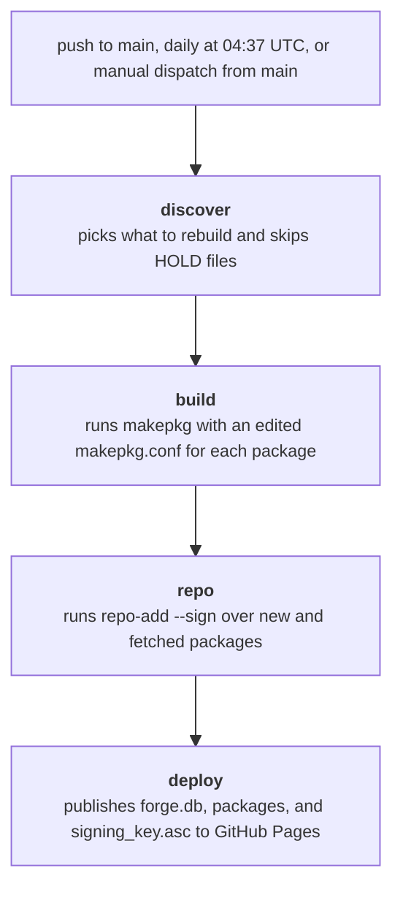

# Forge

Hi. This is my custom Arch Linux package repository.

The packages are built, signed with _GNU Privacy Guard (GPG)_, and published automatically. They're hosted on GitHub Pages. Every push to `main` rebuilds the packages it changed, while a scheduled run at 04:37 UTC rebuilds all of them. Git packages recompute `pkgver()` during the build, and versions advance only when upstream has actually moved. If you run Arch Linux, you can install these packages with `pacman`.

> [!CAUTION]
> Packages that compile to native machine code target `x86-64-v3` and need a compatible CPU. Prebuilt binaries, Python packages, scripts, and themes run on any `x86_64` machine.

## Setup

1. Import and trust the signing key:

   ```bash
   curl -fsSL https://renownitall.github.io/forge/signing_key.asc -o /tmp/forge-signing-key.asc
   sudo pacman-key --add /tmp/forge-signing-key.asc
   sudo pacman-key --lsign-key 45EAC3E28FC392FC4418F415C0C5B611BF77F6E5
   ```

2. Add the following block to your `/etc/pacman.conf`:

   ```ini
   [forge]
   SigLevel = Required DatabaseOptional
   Server = https://renownitall.github.io/forge
   ```

3. Sync and install:

   ```bash
   sudo pacman -Syu
   sudo pacman -S PACKAGE_NAME
   ```

`pacman -Sl forge` lists everything that's published.

## Packages

There are eight packages, each under `packages/`:

| Package               | Description                                                                                                        |
| --------------------- | ------------------------------------------------------------------------------------------------------------------ |
| calpdf-git            | PDF toolkit to run alongside Calibre: download and swap covers, shrink PDFs, and export or rewrite bookmarks (git) |
| exercism-bin          | Download exercises from exercism.org, work on them locally, and submit your solutions (prebuilt binary)            |
| lutgen-cli-git        | Recolor images to match a color theme such as Catppuccin, Gruvbox, or Nord (git)                                   |
| orchis-theme-4px      | Orchis GTK theme built with 4px rounded corners                                                                    |
| orchis-theme-square   | Orchis GTK theme built with fully square corners                                                                   |
| swayfx-git            | Sway compositor with shadows, blur, and rounded corners, built against wlroots 0.20 (git)                          |
| wayfreeze-git         | Freeze the screen to draw a selection and take a screenshot without movement underneath (git)                      |
| xdg-terminal-exec-git | Open the user's preferred terminal emulator from apps and scripts (git)                                            |

## Development

Run `make check` before committing. The check needs `shfmt`, Node, Python, and `uv` on your machine. Pushes that touch only documentation or tooling files build nothing, and a manual dispatch from the Actions tab rebuilds every package.

To skip a package temporarily, create an empty `packages/NAME/HOLD` file. The package stays out of the next build and leaves the repository on the next publish.

## Build pipeline

Each push rebuilds only the packages it changed, while the daily run or a manual dispatch rebuilds everything. Every package builds in its own job, packages that are not rebuilt keep their published copy, and nothing publishes unless every job succeeds.



---

Enjoy.
